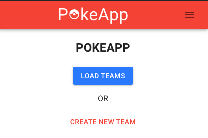

# PokeApp-Backend

Live site link: http://pokeapp-cd.surge.sh/

### Description

This app that allows users to compile teams of six Pokemon. The user can create individual Pokemon, selecting their moves, abilities, natures and the items that they hold, as well as giving them a nickname. Once Pokemon have been created, they can be added to/removed from any existing team a user has created. Users may also select a "favorite" Pokemon which is then displayed on their profile. 

The features described above were included in order to give users an accessible means to model precise details about Pokemon teams and share them with friends.

### Tests

Backend tests are located in the same folders as the methods and routes they are testing.

In order to run tests, enter `npm test` into the terminal. 

### User Flow

Users may demo the Pokemon creation feature upon entering the site without the need to create an account. If users wish to access full site functionality, they may sign up to create an account. Doing so will redirect them to select their favorite Pokemon. Once finished, the user will land on the home page.

From the home page, a registered user may select `CREATE NEW TEAM` to create and name a new empty team, or `LOAD TEAMS` to view existing teams. 
On the teams page, users can edit the team name, or choose to add / remove Pokemon by clicking the options displayed on the cards. 

- API: https://pokeapi.co/docs/v2